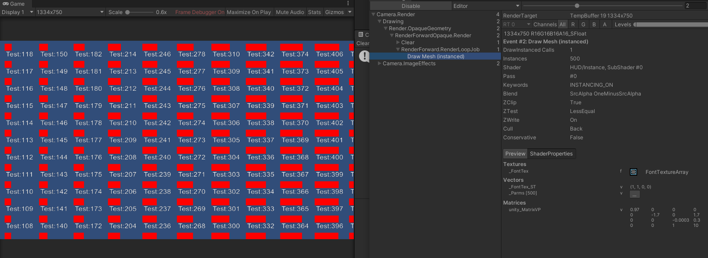
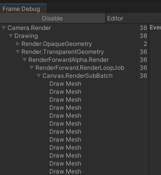
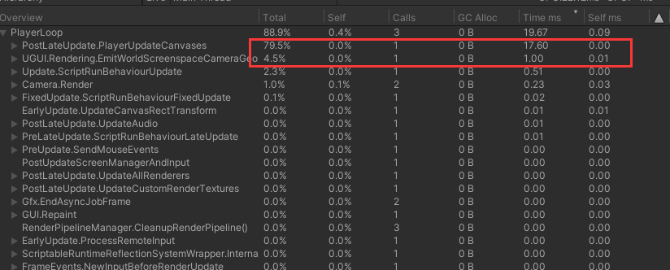
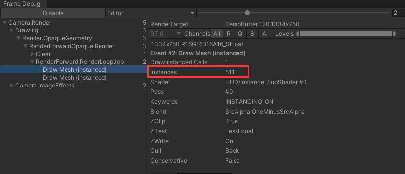
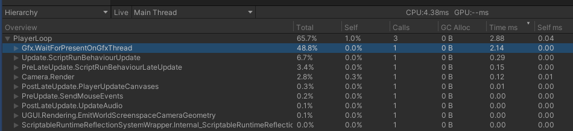

## 主要功能

主要用于游戏中的HUD合批，实现了一个批次渲染所有HUD

## 技术介绍

1.使用了Text渲染到纹理Array，参考FontRender2Texture

2.构建Instance需要的Mesh，参考HUDMeshBuild

3.DrawInstanceManager使用Graphics.DrawMeshInstanced绘制；从ActorManager收集每个对象的坐标及进度条信息

## 效果演示
  

## 与普通UGUI方式比较(渲染1000个HUD，进度条每帧更新)

1.以下是直接使用UGUI渲染，一个Image+一个Text
  
  
2.以下是使用GPU Instance的版本
  
  
3.相对直接使用UGUI，在DrawCall和CPU耗时上，有很大优势

4.UGUI测试时，没有世界坐标->UI坐标转换，如果加上这部分的耗时，优势会更加明显

## 其他注意

1.一次可以提交511个HUD，如果超过511，会强行分批次渲染

2.DrawMeshInstanced在显卡上的耗时，比普通的DrawIndex，多了10倍以上。实际使用中需要测试GPU本身是不是瓶颈再决定用哪种方式
